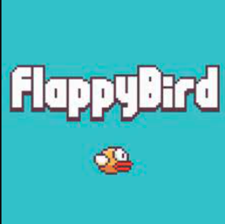
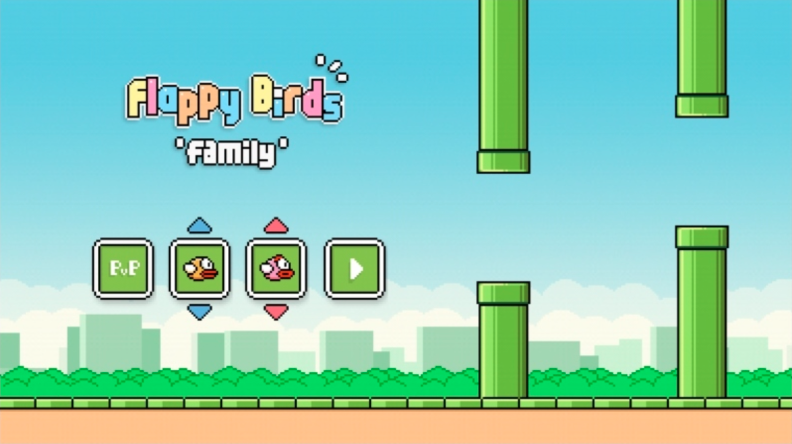
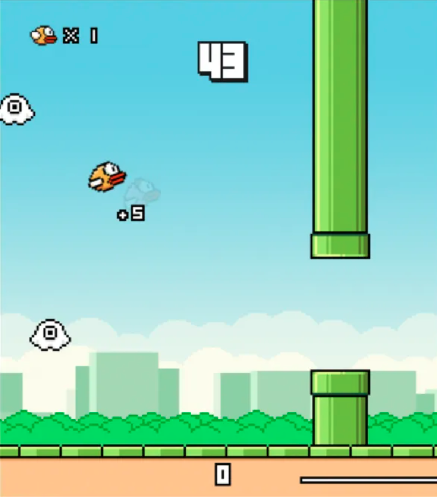

# hover-bird
AP CS Project that is an extension/similar to flappy bird

It will have the same structure of the actual game, meaning the bird will still go through the pipes to get a higher score. A main difference about the functionality of the game is how high the speed is at the current of the level is at, high score, and time alive.

Another significant difference is the main menu, if we are able to get to that in the time we have been given. The main menu will consist of multiple themes that the user will be able to pick from, a default mode, jungle mode, futuristic mode, and a rainbow mode. Each mode will change the background/scenery, the character, the obstacles, and the music that is being played.

How to run the code:
#!/bin/bash
javac src/*.java
java -cp src/ App
rm src/*.class

