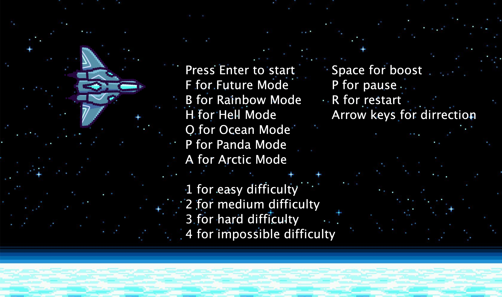

# hover-bird
This project that is essentially an extension to the game flappy bird. We will be adding several other modes/themes to the game that will change the character, background, pipes, and music that is being played. 

-   It will have the same structure of the actual game, meaning the bird will still go through the pipes to get a higher score. A main difference about the functionality of the game is how high the different types of themes, the up and down arrows, and a boost function.

-   Another significant difference is the main menu, if we are able to get to that in the time we have been given. The main menu will consist of multiple themes that the user will be able to pick from, a default mode, jungle mode, futuristic mode, hell mode, and a rainbow mode. Each mode will change the background/scenery, the character, the obstacles, and the music that is being played.

## Things to change/work on
-   update slides
-   lag
-   game working on all resolutions
-   new mode (heaven, dark mode, or something else)
-   hitbox/collision
-   settings bar, adjust music or something
-   highscore
-   after a certain score, get a crown or something to show high status
-   mouse listener

## Potential Slides Topics
-   game description
-   how we worked together
-   new topics/what we learned
-   design process
-   heirarchy/uml diagrams
-   timeline
-   basics to the code
-   roadblocks
-   live demo
-   things you could work on next

## How to use the terminal
```zsh
# pulls all the latest code
git pull

# shows status of files locally
git status

# stages all files that are changed
git add .

# commits all the staged changes locally
git commit -m 'Message'

# locally commits are pushed to the server
git push

# creates a branch
git checkout -b BranchName

# switch branch
git checkout BranchName
```
## How to run the code
```zsh
# initially you need to ensure that the run script is executable
chmod +x run

# run the program (1st it compiles, then runs java pointed at the main class aka Window)
./run
```




